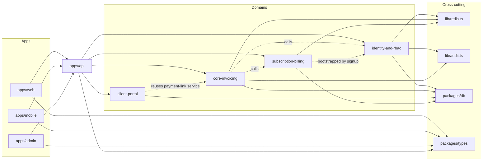

# Functionality graph

A compact map of what depends on/is consumed by what, for orienting on a change without re-reading the whole repo — read this alongside the relevant [`.claude/wiki/`](../wiki/) page before touching a domain. **Hand-authored and maintained by convention, not auto-generated** — see the trade-off note at the bottom.

## Whole-system shape

## identity-and-rbac

- **depends_on**: `packages/db` (identity schema), `lib/redis.ts` (permissions cache), `lib/audit.ts`, `lib/auth/{password,tokens}.ts`.
- **provides_services**: `services/auth/{signup,login,refresh,logout,verify-email,password-reset}.ts`. `signup()` also bootstraps a workspace, `ADMIN` membership, a `FREE` subscription (subscription-billing), and default `reminder_rules` (core-invoicing) — one transaction, three domains' initial state.
- **exposed_via_routes**: `routes/{auth,workspaces,invitations}.ts`, `routes/admin.ts` (platform-role only).
- **middleware**: `authenticate`, `resolveWorkspace`, `requireRole`, `requireOwner`, `requirePlatformRole` — every other domain's routes compose these, never reimplement.
- **jobs**: `jobs/expire-stale-invitations.ts` (daily, unaccepted + past-expiry → `EXPIRED`).
- **consumed_by**: `apps/web`, `apps/mobile` (login/signup/workspace picker), `apps/admin` (platform-role login only).
- **gotchas**: see `.claude/wiki/mistakes.md` — workspace suspension cache invalidation; `resolveWorkspace` reads the `x-workspace-id` header for routes not nested under `/workspaces/:id/...`.

## core-invoicing

- **depends_on**: `identity-and-rbac` (auth middleware, `workspace_members`), `subscription-billing` (`checkPlanLimit` before invoice/client creation), `lib/money/decimal.ts`, `lib/redis.ts` (dashboard, invoice-detail and PDF caches), `lib/audit.ts`.
- **provides_services**: `services/invoicing/{invoices,status,generate-invoice-number,pdf,receipts}.ts`, `services/payments/{process-webhook,providers/{razorpay,stripe}}.ts`, `services/dashboard/summary.ts`.
- **exposed_via_routes**: `routes/{clients,invoices,webhooks,dashboard,events}.ts`.
- **jobs**: `jobs/{mark-overdue-invoices,send-reminders}.ts` (both skip Free-plan workspaces via `subscription-billing`).
- **consumed_by**: `apps/web` (clients/invoices/dashboard pages, PDF download via its `app/api/invoices/[id]/pdf` proxy route), `apps/mobile` (clients/invoices tabs, Home screen), `client-portal` (reuses the payment-link creation service, not a duplicate implementation).
- **dashboard payload**: `getDashboardSummary()` returns outstanding / paid / paidThisMonth / overdue / dueSoon / revenueTrend / recentPayments in **one** cached response — both the web dashboard and the mobile Home screen read it. `paidThisMonth` and `revenueTrend` come from `payments.paidAt`, not invoice status. Changing this shape touches both frontends.
- **gotchas**: see `.claude/wiki/mistakes.md` — invoice numbering provisioning off-by-one; every total is grouped by currency and never summed across them.

## client-portal

- **depends_on**: `core-invoicing` (the invoice/payment data it surfaces, and its payment-link creation service), `lib/redis.ts` (rate limiting), `lib/email.ts`.
- **provides_services**: `services/portal-auth/{portal-auth,portal-invoices}.ts`.
- **exposed_via_routes**: `routes/{portal,portal-auth}.ts`, with its **own** middleware chain (`authenticate-portal-session`, `resolve-client-context`) — never mixed with `identity-and-rbac`'s tenant chain.
- **consumed_by**: nothing yet — backend complete, no frontend built.
- **gotchas**: isolation check (`resolveClientContext`) must run on every request, never cached as "already authorized this session."

## subscription-billing

- **depends_on**: `identity-and-rbac` (`requireOwner`), `lib/redis.ts` (plan cache).
- **provides_services**: `services/subscriptions/{check-plan-limit,subscription-billing}.ts`. `checkPlanLimit()` is the single entry point every gated action calls — never read `config/plan-limits.ts` directly.
- **exposed_via_routes**: `routes/{billing,subscription-webhooks}.ts` — deliberately separate files from `routes/webhooks.ts` (core-invoicing's payment webhooks); the subscription webhook handler only ever writes to `subscriptions`.
- **called_by**: `core-invoicing` (`createInvoice`/`createClient`, `send-reminders` job), `identity-and-rbac` (team-invite flow) — all via `checkPlanLimit()`.
- **consumed_by**: `apps/web` (billing settings), `apps/mobile` (`GET /billing/plan` — its entire surface for this domain, no checkout/cancel/IAP).

## Cross-cutting libs

- **`lib/redis.ts`**: `cacheAside`/`invalidateCache`/`invalidateCachePattern` — the only cache in the system. Mostly short-TTL, correctness-sensitive data (permissions, dashboard, plan); long TTLs are allowed only for immutable content (finalized invoice PDFs). Every key is `workspace:{id}:...`-scoped, no exceptions.
- **`lib/audit.ts`**: `writeAuditEvent`/`withAdminAuditLog` — backs `invoice_events`, used by both `core-invoicing` (financial events) and `identity-and-rbac` (auth/membership events, admin-audit-on-view).
- **`packages/db`**: the schema is the cross-domain source of truth — `schema/{identity,invoicing,client-portal,subscriptions}.ts`, all re-exported from one index.
- **`packages/types`**: Zod schemas shared between API validation (`middleware/validate.ts`) and every frontend's forms — never redefined per-app.

## Why this is hand-authored, not auto-generated

A "Graphify" that parses `import` statements (`grep`/`ts-morph`) was considered and deliberately dropped: an import graph tells you *that* file A touches file B, but the actual value here — the curated cross-domain relationships and gotchas above — isn't derivable from imports alone (e.g. "core-invoicing calls subscription-billing's checkPlanLimit" is an import; "why the file boundary between webhooks.ts and subscription-webhooks.ts exists" isn't). Building a robust auto-generator was judged a meaningfully bigger, separate undertaking than the value it'd add over this file kept honest by convention (`.claude/rules/ai-context-workflow.md`). Revisit if this file's staleness becomes a recurring real problem, not speculatively.
